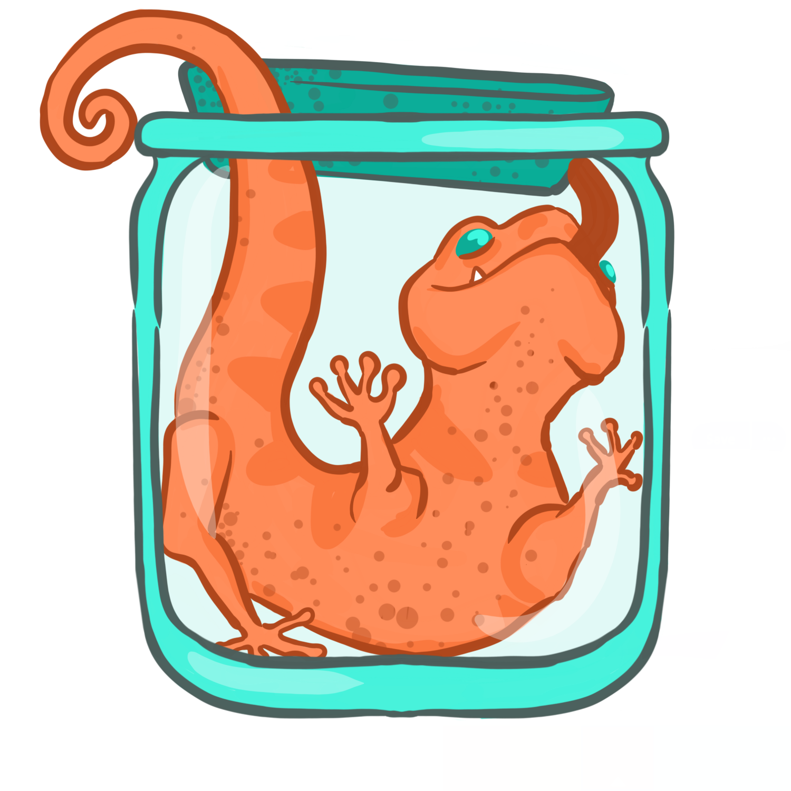

# Lizards: Rusty file compression

## About
Lizards is a rust implementation of file compression (and decompression).
Uses the below two processes to compress files:
* [Huffman Coding](https://en.wikipedia.org/wiki/Huffman_coding) 
* [LZSS](https://en.wikipedia.org/wiki/Lempel%E2%80%93Ziv%E2%80%93Storer%E2%80%93Szymanski)

### Design Decisions
* The "Lookback buffer" is the buffer kept for making matches. Bigger size should result in better compression
  * Its size needs to be known on both compression and decompression.
  * The size is hence encoded in the header, which is a static cost to compression ratio.
  * It's possible a file compressed with a huuuuuuuuuge buffer would be uncompressable elsewhere if not enough memory was available
* When decoding the huffman tree, some degree of "stop" pattern is necessary if the encoded bits don't byte-align perfectly.
  * A "stop" code is included in the tree
  * For size efficiency since we know how many bytes we're reading in a chunk, only the needed bits are written til to end of the byte
  * When decoding, hitting either a valid stop code of end of the bytes (whether halfway through a "stop" or not) count as finishing that chunk
  * Including this code does add at least 2 nodes to the tree
* The huffman tree is dynamic and included in the header. The serialisation is currently depending on some random serde library and not important
  * It can be pretty big though, given the tree structure
  * It's possible printing the {u8 -> Bits} map (aka CodeMap) would be more space efficient and expect 
  

### TODOs:
* Enable and Disable generating of debug output file, it's not of use other than to developers working on [lizards]
* Build the huffman tree from a first quick pass of the file so we don't need to store all symbols in memory before encoding
* Handle the repetition edge cases that allow us to match into the "read buffer" when matching which should vastly improve match compression

### Why the name
If you say it really quickly "LZSS" sounds a bit like "Lizards". That's it

